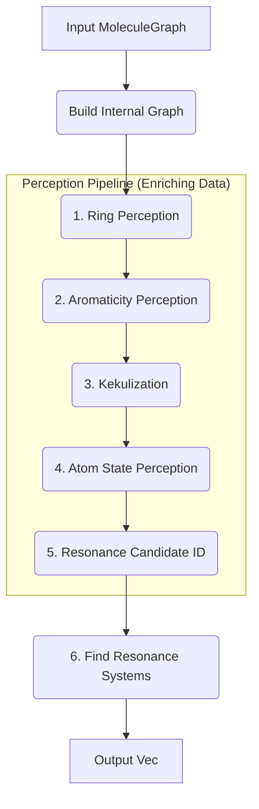
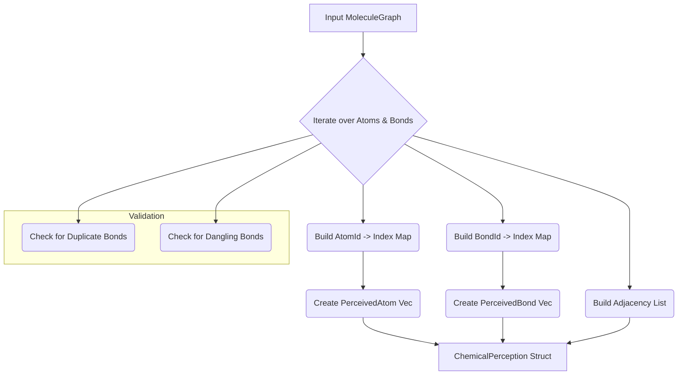
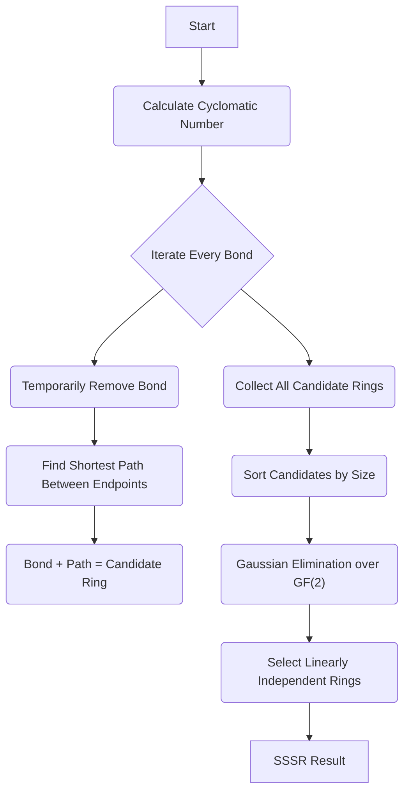
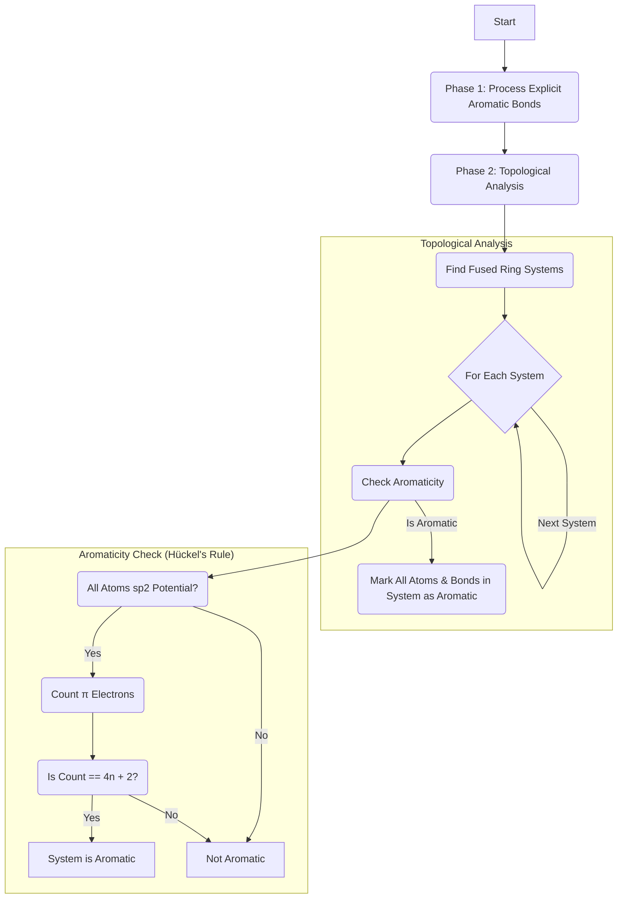
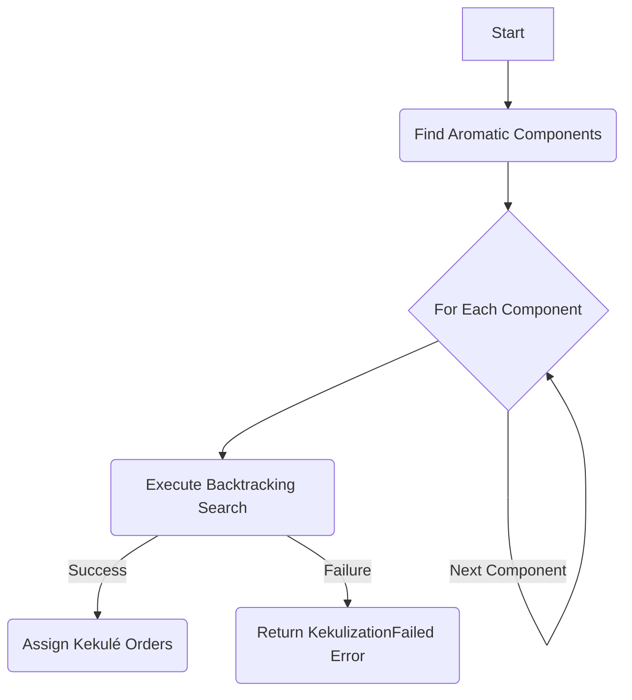
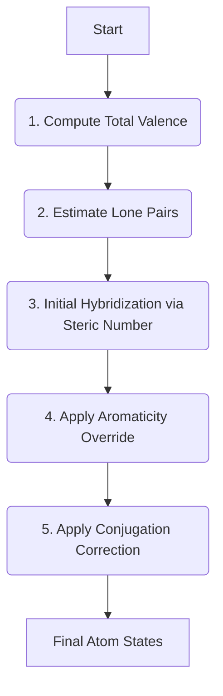
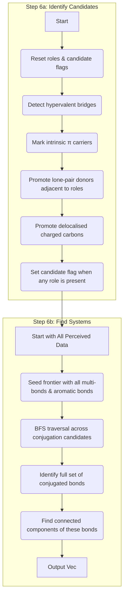

# Pauling Architecture

This document provides a detailed architectural overview of the `pauling` library. It outlines the main data flow of the chemical perception pipeline and delves into the specific algorithms and heuristics used in each stage.

## Main Pipeline Overview

The core of `pauling` is a multi-stage pipeline that takes a molecular graph as input and enriches it with chemical information step-by-step. The central data structure is `ChemicalPerception`, which acts as an internal, mutable representation of the molecule, accumulating metadata at each stage. The final stage uses this rich information to identify and group conjugated atoms and bonds into distinct resonance systems.

- **Input MoleculeGraph**: The user provides any data structure that implements the `MoleculeGraph` trait. The library operates on this read-only view.
- **Build Internal Graph**: The input graph is converted into the internal `ChemicalPerception` structure. This step also performs initial validation (e.g., checking for duplicate bonds).
- **1. Ring Perception**: Identifies the Smallest Set of Smallest Rings (SSSR) in the graph.
- **2. Aromaticity Perception**: Uses ring information and Hückel's rule to identify aromatic systems.
- **3. Kekulization**: Assigns a valid alternating single/double bond pattern (Kekulé structure) to detected aromatic rings.
- **4. Atom State Perception**: Calculates properties like valence, lone pair count, and hybridization for each atom based on the graph topology and Kekulé structure.
- **5. Resonance Candidate ID**: Marks atoms that are eligible to participate in resonance.
- **6. Find Resonance Systems**: Traverses the graph to find all connected networks of conjugated atoms and bonds, grouping them into `ResonanceSystem`s.
- **Output `Vec<ResonanceSystem>`**: The final result is a list of all identified resonance systems.

---

## 1. Graph Ingestion & Internal Representation

Before perception begins, the library converts the user-provided `MoleculeGraph` into its own internal representation, `ChemicalPerception`. This structure is designed for efficient queries and to hold the metadata generated during the pipeline.

- **Atom/Bond to Index Maps**: `HashMap`s are created to map the user-provided stable `AtomId` and `BondId` to a `usize` index. This allows for fast, `O(1)` average-time access to atom and bond data stored in vectors.
- **PerceivedAtom / PerceivedBond**: These are internal structs that store not only the initial data (element, charge, order) but also have fields for all metadata to be perceived (`is_aromatic`, `hybridization`, `kekule_order`, etc.).
- **Adjacency List**: An adjacency list (`Vec<Vec<(usize, BondId)>>`) is built for efficient graph traversal. Each entry stores the index of the neighboring atom and the ID of the connecting bond.
- **Validation**: During this stage, critical graph integrity checks are performed:
  - **Duplicate Bonds**: A `HashSet` tracks atom pairs to ensure no two bonds connect the same pair of atoms.
  - **Dangling Bonds**: When processing a bond, if its start or end `AtomId` is not found in the `atom_id_to_index` map, an `InconsistentGraph` error is returned.

---

## 2. Ring Perception (SSSR)

This stage identifies all fundamental rings in the molecule. The library implements an algorithm to find the Smallest Set of Smallest Rings (SSSR), which forms a basis for all cycles in the graph.

- **Cyclomatic Number**: First, the expected number of rings is calculated using Euler's formula for planar graphs: `num_rings = num_bonds - num_atoms + num_components`.
- **Candidate Generation**: The algorithm iterates through every bond in the graph. For each bond, it is conceptually "removed," and a Breadth-First Search (BFS) is used to find the shortest path between its two original endpoints. The removed bond, combined with this path, forms a fundamental cycle.
- **Minimal Cycle Basis Selection**: Not all candidates are needed. The set of candidates is then reduced to a minimal basis using linear algebra over the GF(2) field (where addition is XOR).
  - **Sorting**: Candidates are first sorted by size (number of bonds). This ensures that when a choice is possible, the smaller ring is preferred, fulfilling the "Smallest Set of **Smallest Rings**" criterion.
  - **Gaussian Elimination**: Each ring is represented as a bit vector (`BitVec`), where the i-th bit is 1 if the i-th bond of the molecule is in the ring. The algorithm iteratively builds a basis of linearly independent vectors. A new ring is added to the SSSR only if its bit vector cannot be formed by a linear combination (XOR sum) of the vectors already in the basis.

---

## 3. Aromaticity Perception

This module determines which rings, atoms, and bonds are aromatic. It's a two-phase process that combines explicit user input with a topological analysis based on Hückel's rule.

- **Phase 1: Explicit Aromaticity**: The pipeline first trusts the input. If any bonds are explicitly marked with `BondOrder::Aromatic`, these bonds and their connected atoms are immediately flagged as aromatic.
- **Phase 2: Topological Analysis**:
  - **Find Fused Ring Systems**: Rings from the SSSR are grouped into connected components. Two rings are in the same component if they share at least one bond. This correctly identifies isolated rings (like benzene) and fused systems (like naphthalene).
  - **Check Aromaticity**: Each fused system is checked against a set of criteria based on **Hückel's Rule**:
    1. **Planarity Check**: All atoms in the ring system must be capable of sp2 hybridization. The heuristic checks if an atom's degree is ≤ 3 and if it's a common element involved in conjugation (C, N, O, S, etc.).
    2. **π Electron Counting**: The number of π electrons is counted based on specific chemical rules implemented in `pi_electrons_for_atom`:
       - An atom in a multiple bond within the system contributes **1** electron (e.g., carbon in benzene).
       - A neutral, 2-connected Oxygen or Sulfur contributes **2** electrons (e.g., furan, thiophene).
       - A neutral, 3-connected Nitrogen contributes **2** electrons (e.g., pyrrole), but a positively charged one contributes **0**.
       - A 3-connected Carbon with a -1 charge contributes **2** electrons (e.g., cyclopentadienyl anion).
       - A 3-connected Carbon with a +1 charge contributes **0** electrons (e.g., tropylium cation).
    3. **Apply Rule**: The system is aromatic if the total π electron count is a "Hückel number" (2, 6, 10, 14, ...), which satisfies the formula `4n + 2` for some integer `n ≥ 0`.

---

## 4. Kekulization

Once aromatic systems are identified, this stage assigns a chemically valid, alternating single- and double-bond pattern (a Kekulé structure) to them. This is necessary for correct valence calculations.

- **Find Aromatic Components**: The algorithm first finds connected subgraphs consisting solely of aromatic bonds. This correctly handles molecules with multiple, separate aromatic systems (e.g., biphenyl).
- **Backtracking Search**: For each component, a recursive backtracking algorithm is employed to find a valid assignment.
  - The algorithm iterates through the aromatic bonds of the component. At each bond, it tries to assign a `BondOrder::Double`.
  - **Constraint Check**: An assignment is valid only if the atoms at both ends of the bond do not already have an adjacent double bond within the aromatic system.
  - **Recursion**: If assigning `Double` is valid, it recursively calls itself for the next bond. If the recursive call succeeds, the solution is found.
  - **Backtrack**: If the recursive call fails, or if assigning `Double` was not valid, it backtracks, undoes the assignment, and tries assigning `BondOrder::Single`. It then recurses again.
  - **Failure**: If all possibilities are exhausted without a solution, the search fails. A `KEKULIZATION_ATTEMPT_LIMIT` prevents infinite loops on pathological structures.

---

## 5. Atom State Perception

This module calculates key atomic properties that depend on the complete, Kekulized graph topology.

- **1. Compute Total Valence**: For each atom, the algorithm sums the multiplicities of its incident bonds. If a bond has a `kekule_order` (from Kekulization), that order is used; otherwise, the original bond order is used.
- **2. Estimate Lone Pairs**: Lone pairs are calculated using a valence electron counting heuristic:
  `non_bonding_electrons = (valence_electrons) - (formal_charge) - (total_valence)`
  `lone_pairs = non_bonding_electrons / 2`
- **3. Initial Hybridization**: The initial hybridization is determined by the steric number: `steric_number = (number of neighbors) + (lone_pairs)`.
  - 2 -> SP
  - 3 -> SP2
  - 4 -> SP3
- **4. Aromaticity Override**: Any atom previously marked as `is_aromatic` has its hybridization set to `SP2`, as this is a prerequisite for aromaticity.
- **5. Conjugation Correction**: A crucial refinement is applied. If an atom has `SP3` hybridization and at least one lone pair, and it is bonded to an atom that is `SP` or `SP2`, its hybridization is "corrected" to `SP2`. This correctly models atoms like the nitrogen in aniline, whose lone pair participates in resonance with the benzene ring.

---

## 6. Resonance System Identification

This is the final phase, which combines all previously perceived information to identify the final resonance systems. It consists of two sub-steps: identifying candidate atoms and then grouping them into systems.

- **Step 6a: Identify Conjugation Candidates**: The candidate pass now accumulates a `ConjugationRole` bitset on each atom and only lifts `is_conjugation_candidate` once at least one role is present. The tracked roles are `PI_CARRIER`, `LONE_PAIR_DONOR`, `CHARGE_MEDIATOR`, and `HYPERVALENT_BRIDGE`.
  - **Reset**: Every atom starts with `ConjugationRole::NONE` and `is_conjugation_candidate = false` to clear previous runs.
  - **Hypervalent bridges**: Atoms such as P, S, Cl, Br, or I with valence > 4 that contact a π partner (double/triple bond) and a σ partner able to donate (lone pairs, negative charge, or classical conjugation elements) record `HYPERVALENT_BRIDGE`.
  - **Intrinsic π carriers**: Aromatic atoms or atoms inferred as `SP`/`SP2` insert `PI_CARRIER`, with a guard that avoids neutral, multi-coordinated ether-like oxygens immediately bound to a hypervalent bridge (those atoms should not seed resonance by themselves).
  - **Lone-pair donors**: Atoms with lone pairs adjacent to any existing role (other than pure hypervalent bridges) add `LONE_PAIR_DONOR`, unless the atom is a neutral oxygen with degree > 1 and zero formal charge (e.g., dimethyl ether), preventing over-promotion of spectator lone pairs.
  - **Charged carbons**: Allylic-style carbocations (formal +1, degree 3) and carbanions (formal -1) acquire `CHARGE_MEDIATOR`.
  - **Finalize**: The pass sets `is_conjugation_candidate` to `true` wherever the accumulated roles are non-empty, keeping bridging ligands without roles (e.g., phosphate ester oxygens) outside the conjugated core while still flagging the surrounding hypervalent centre and delocalised partners.
- **Step 6b: Find Systems**:
  - **Seeding**: The search starts with a "frontier" set containing all bonds that are definitively part of a conjugated system: all double bonds, triple bonds, and any bond with a Kekulé double bond assignment.
  - **Expansion (BFS)**: A Breadth-First Search (BFS) expands from this frontier. The search traverses from a conjugated bond, through a candidate atom, to an adjacent bond. If the atom on the other side of that adjacent bond is also a candidate, the adjacent bond is added to the set of conjugated bonds and to the search frontier.
  - **Grouping**: After the BFS completes, the full set of all conjugated bonds in the molecule has been identified. A final traversal groups these bonds into connected components. Each component, along with all atoms participating in its bonds, forms one `ResonanceSystem`.
